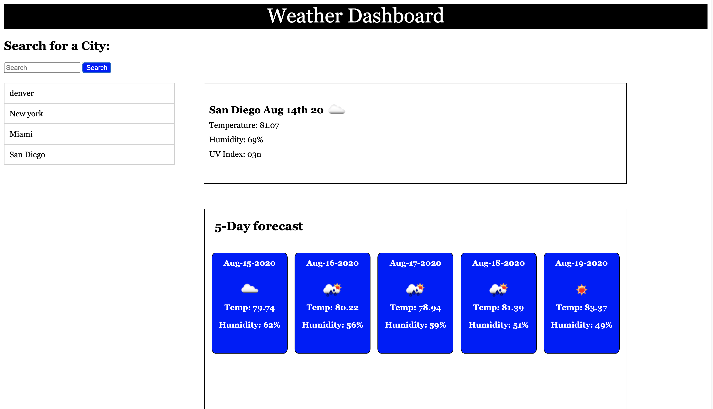

# Weather Dashboard

My weather dashboard shows the current weather for any city in the US, as well as a five-day forecast for the week of temperature, humidity, and an icon for sunny, cloudy, or rainy. 

## Overview

I can search for a city and I am presented with current and future conditions for that city and that city is added to the search history
I can view current weather conditions for that city
For current weather conditions I am presented with the city name, the date, an icon representation of weather conditions, the temperature, the humidity, the wind speed, and the UV index.
I can view future weather conditions for that city and I am presented with a 5-day forecast that displays the date, an icon representation of weather conditions, the temperature, and the humidity
I can click on a city in the search history and I am again presented with current and future conditions for that city

## Images

## links

https://nickgusd.github.io/Weather-Dashboard/
https://github.com/nickgusd/Weather-Dashboard

## Note

The dashboard looks best on a 1440px x 821px device
